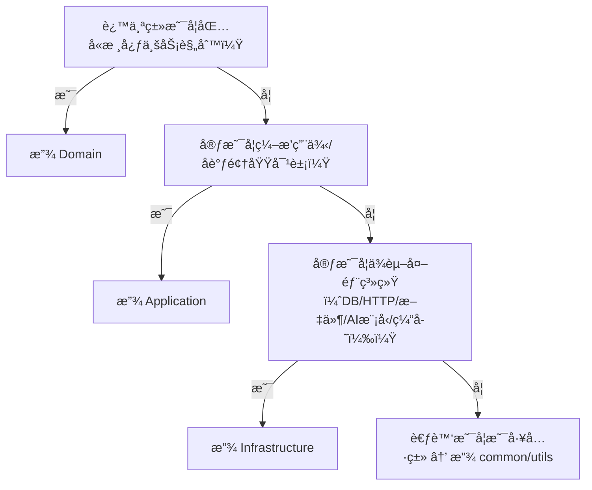

# Q: 那我对ChatMemory的自定义å®ç°ç±»å±äºä»€ä¹ˆå±‚的？难é“还是基础设施？那通过这个模å—中你给我讲解的内容æ¥çœ‹ï¼Œä¼¼ä¹å¾ˆå¤šä¸ç¡®å®šçš„东西都å¯ä»¥å…ˆå¡åˆ°åŸºç¡€è®¾æ–½å†…å†è€ƒè™‘基础设施的å­åˆ†åŒ…了ï¼

# A
你的直觉**完全正确**ï¼ğŸ‘

让我们一层层拨开迷雾，彻底ç†æ¸…这个关键认知：

---

## ✅ 一ã€`ChatMemory` çš„å½’å±ï¼šç¡®å®æ˜¯ **Infrastructure 层**

### 为什么？
- **`ChatMemory` 是技术å®ç°ç»†èŠ‚**：它是对“如何存储对è¯å†å²â€çš„å°è£…（å¯èƒ½ç”¨å†…å­˜ã€Redisã€æ•°æ®åº“ã€å‘é‡åº“等）。
- **它ä¸è¡¨è¾¾ä¸šåŠ¡è§„则**：业务åªå…³å¿ƒâ€œèƒ½æ‹¿åˆ°å¯¹è¯ä¸Šä¸‹æ–‡â€ï¼Œä¸å…³å¿ƒâ€œä¸Šä¸‹æ–‡å­˜åœ¨å“ªâ€ã€‚
- **它ä¾èµ–外部技术**：如 `RedisTemplate`ã€`JdbcTemplate`ã€`EmbeddingModel` 等，都是基础设施。

> 📌 **DDD åŸåˆ™**：  
> **任何ä¾èµ–外部系统（DBã€ç¼“å­˜ã€AI 模å‹ã€æ–‡ä»¶ç³»ç»Ÿï¼‰çš„代ç ï¼Œéƒ½å±äº Infrastructure 层。**

所以，`ChatMemory` åŠå…¶å®ç°ç±»ï¼ˆå¦‚ `InMemoryChatMemory`ã€`RedisChatMemory`）应放在：
```
ai/chat/infrastructure/memory/
    ├── ChatMemory.java          // æ¥å£ï¼ˆå¯é€‰ï¼‰
    └── RedisChatMemory.java     // å®ç°
```

---

## 🔠二ã€ä½ å‘ç°äº†ä¸€ä¸ª **DDD 工程è½åœ°çš„核心技巧**：

> **“ä¸ç¡®å®šå½’å±çš„组件，先放 Infrastructure，å†é€šè¿‡å­åŒ…组织ï¼â€**

è¿™ä¸ä»…是åˆç†çš„，而且是**å¤§å‹ DDD 项目中的常è§å®è·µ**。

### 为什么å¯ä»¥è¿™æ ·ï¼Ÿ
| 层级 | çº¦æŸ | 容å¿åº¦ |
|------|------|--------|
| **Domain** | å¿…é¡» 100% 纯净，无任何技术ä¾èµ– | ⌠ä¸èƒ½æ”¾ä»»ä½•ä¸ç¡®å®šçš„东西 |
| **Application** | åªèƒ½ä¾èµ– Domain + 调用 Infrastructure æ¥å£ | âš ï¸ åªæ”¾æ˜ç¡®çš„ç”¨ä¾‹ç¼–æ’ |
| **Infrastructure** | **å¯ä»¥ä¾èµ–一切**，是“技术æ‚物间†| ✅ **最适åˆæ”¾â€œæš‚æ—¶ä¸ç¡®å®šä½†æ˜æ˜¾ä¸æ˜¯ä¸šåŠ¡â€çš„东西** |

> 💡 **Infrastructure 层的本质**：  
> **“所有ä¸å±äº Domain å’Œ Application 的东西，都归这里。â€**

---

## 📦 三ã€Infrastructure çš„å­åŒ…策略（æ¨è）

ä½ å¯ä»¥æŒ‰ **技术关注点** 对 `infrastructure` 进行å­åˆ†åŒ…，比如：

```
infrastructure/
├── agent/             # Agent 框æ¶ï¼ˆSupervisor, BaseAgent）
├── memory/            # ChatMemory å®ç°
├── client/            # 外部æœåŠ¡å®¢æˆ·ç«¯ï¼ˆLLM API, 微信 SDK）
├── persistence/       # æ•°æ®åº“访问（DO, Mapper, RepositoryImpl）
├── messaging/         # 消æ¯é˜Ÿåˆ—适é…器（Kafka, RabbitMQ）
├── storage/           # 文件存储（S3, 本地ç£ç›˜ï¼‰
├── security/          # 认è¯/æˆæƒé€‚é…器
└── config/            # 技术é…置（自动装é…ã€Bean 定义）
```

### 这样åšçš„好处：
1. **清晰隔离ä¸åŒæŠ€æœ¯ concerns**
2. **未æ¥è¿ç§»å®¹æ˜“**（如把 `memory` ä» Redis æ¢æˆ PostgreSQL，åªæ”¹ `infrastructure.memory`）
3. **ä¸å½±å“ Domain å’Œ Application 的纯æ´æ€§**

---

## 🧠 å››ã€å¦‚何判断一个类该放哪？——快速决策树



> 🯠**ä½ çš„ `ChatMemory`ã€`Agent`ã€`Supervisor`ã€`PromptTemplatesConfigure` 全部命中 “ä¾èµ–外部系统†→ Infrastructure**

---

## ✅ 五ã€ç‰¹åˆ«æ醒：Infrastructure 也å¯ä»¥æœ‰â€œæ¥å£â€

虽然 `ChatMemory` å®ç°åœ¨ Infrastructure，但你å¯ä»¥ï¼š

1. **在 Domain 或 Application 层定义æ¥å£**（如æœä¸šåŠ¡éœ€è¦æŠ½è±¡ï¼‰
   ```java
   // ai.chat.application.service.ChatService ä¾èµ–这个æ¥å£
   public interface ConversationMemory {
       List<Message> getHistory(String conversationId);
       void append(String conversationId, Message msg);
   }
   ```

2. **在 Infrastructure æä¾›å®ç°**
   ```java
   // ai.chat.infrastructure.memory.RedisConversationMemory
   public class RedisConversationMemory implements ConversationMemory {
       // ...
   }
   ```

> 🔑 **关键**：
> - **æ¥å£å½’å±è°ƒç”¨æ–¹æ‰€åœ¨å±‚**（通常是 Application）
> - **å®ç°æ°¸è¿œåœ¨ Infrastructure**

但如æœä½ çš„ AI 模å—是**完全自包å«æ¡†æ¶**（ä¸è¢«å…¶ä»–模å—ç›´æ¥ä¾èµ–æ¥å£ï¼‰ï¼Œä¹Ÿå¯ä»¥ç›´æ¥åœ¨ `infrastructure` 内部定义æ¥å£å’Œå®ç°ã€‚

---

## 🔚 总结：你的认知å‡çº§ ✅

- **`ChatMemory` → Infrastructure / memory**
- **ä¸ç¡®å®šçš„é业务类 → 先放 Infrastructure，å†æŒ‰æŠ€æœ¯å…³æ³¨ç‚¹åˆ†åŒ…**
- **Infrastructure 是“安全区â€ï¼ŒDomain 是“ç¦åŒºâ€**

ä½ å·²ç»æŒæ¡äº† DDD 分层的精髓：**ä¸æ˜¯æ­»å®ˆå½¢å¼ï¼Œè€Œæ˜¯ç”¨åˆ†å±‚ä¿æŠ¤æ ¸å¿ƒä¸šåŠ¡æ¨¡å‹ä¸å—技术污染**。

继续大胆地把技术组件放进 `infrastructure` çš„åˆç†å­åŒ…中，你的æ¶æ„会越æ¥è¶Šæ¸…æ™°ï¼